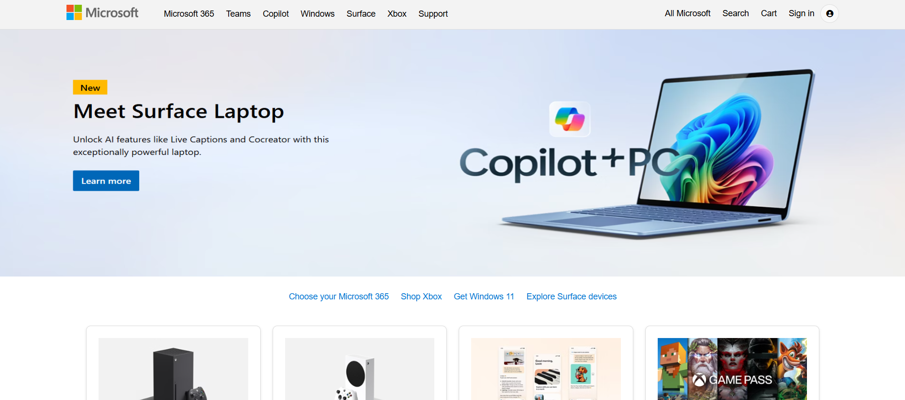
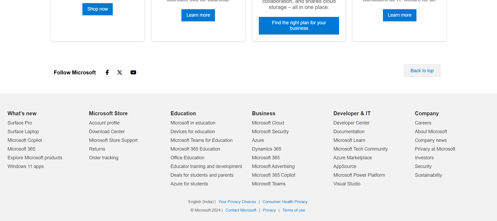

<h1 align = "center">🖥️ Microsoft Website Clone</h1>

- A clone of Microsoft Website.
- Building this with intention of learning HTML, CSS.

---

***📸 Screenshots***
---

<table border="1">
  <thead>
    <tr>
      <th style="text-align:center;" >1</th>
    </tr>
  </thead>
  <tbody>
    <tr>
      <td></img></td>
    </tr>
  </tbody>
</table>

<table border="1">
  <thead>
    <tr>
      <th style="text-align:center;" >2</th>
      <th style="text-align:center;">3</th>
    </tr>
  </thead>
  <tbody>
    <tr>
      <td></img></td>
      <td></img></td>
    </tr>
  </tbody>
</table>
 

---

**Orignal Wesite**
[Link](https://www.microsoft.com/en-in)
---
<h4>The original website’s UI may evolve over time, so this clone reflects its design at the time of development.</h4>

